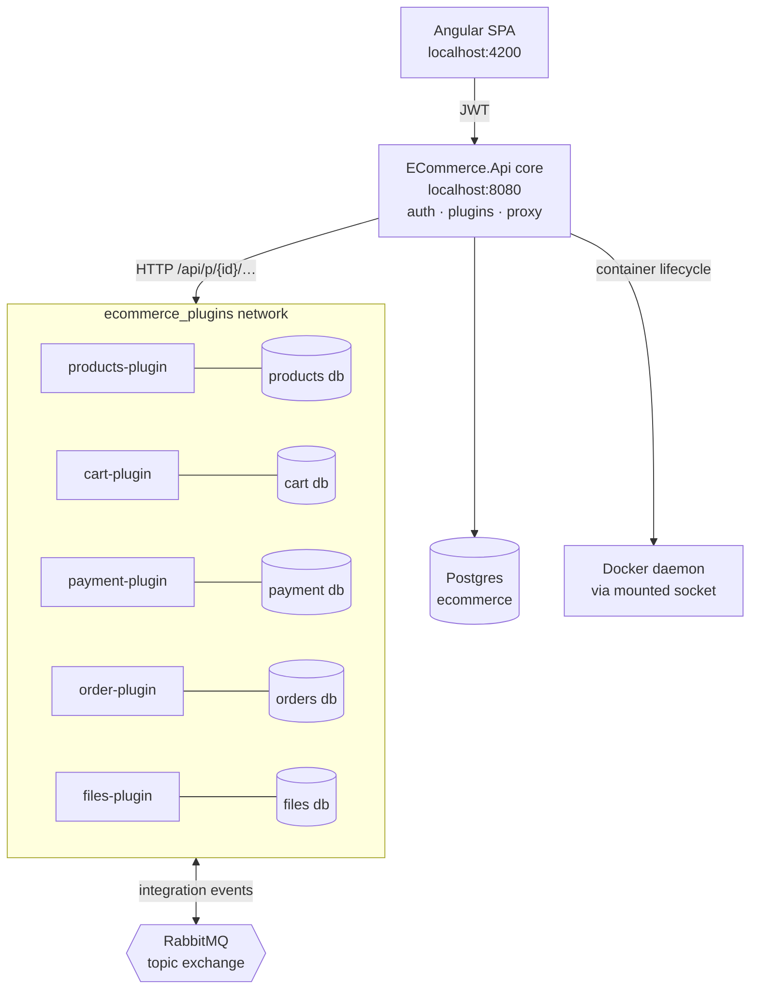
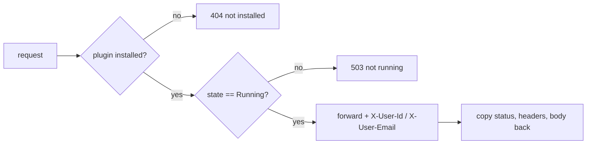
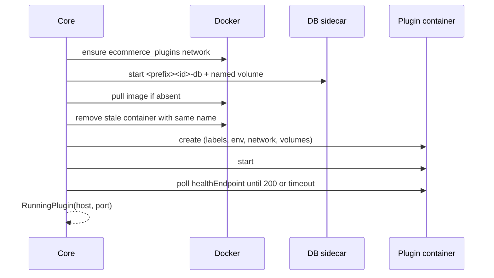
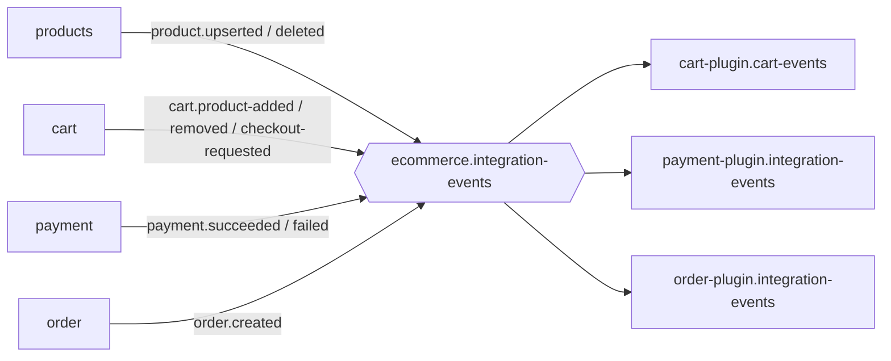
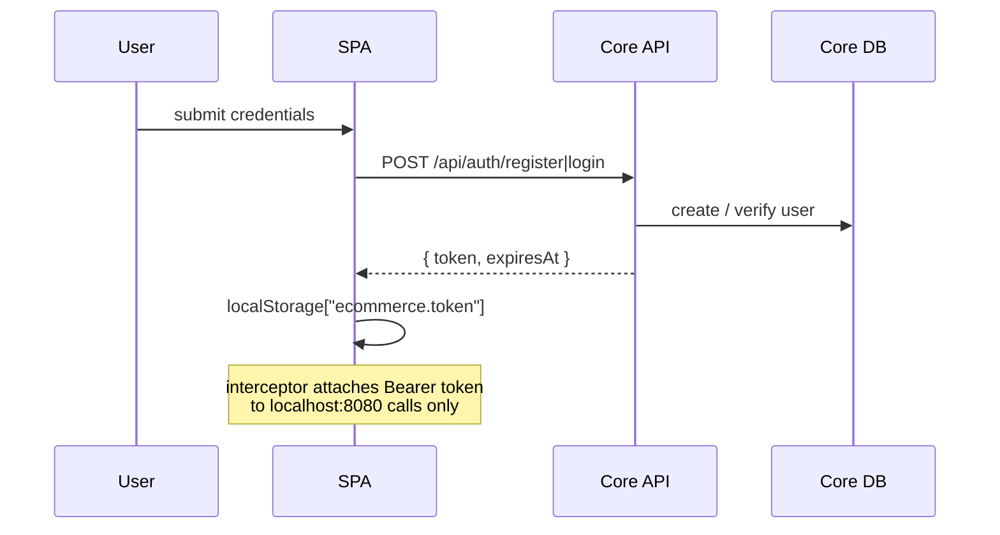
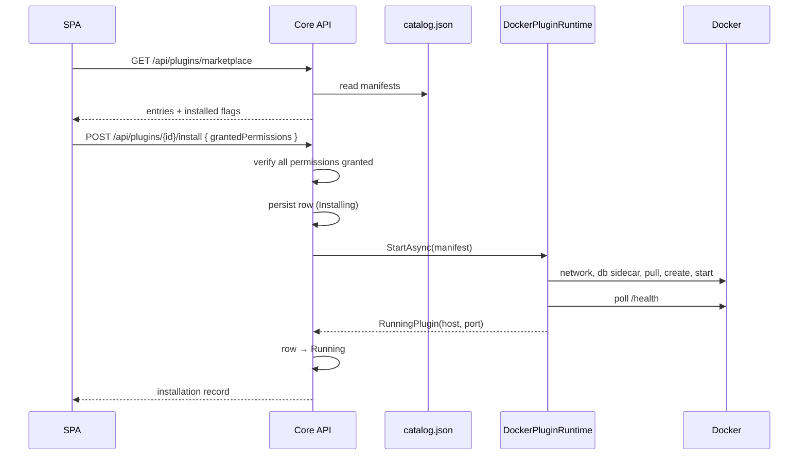
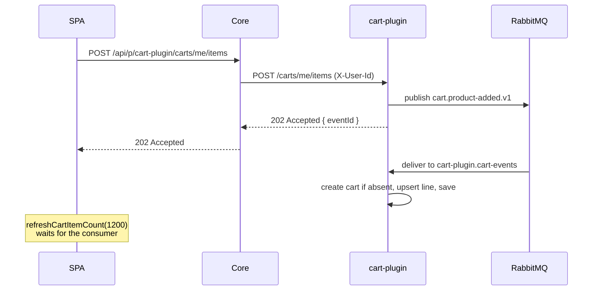
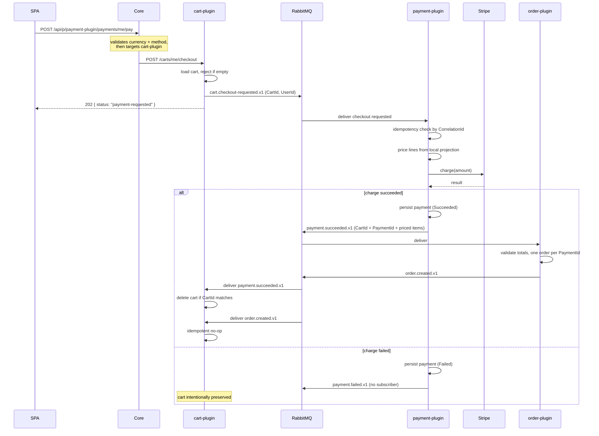
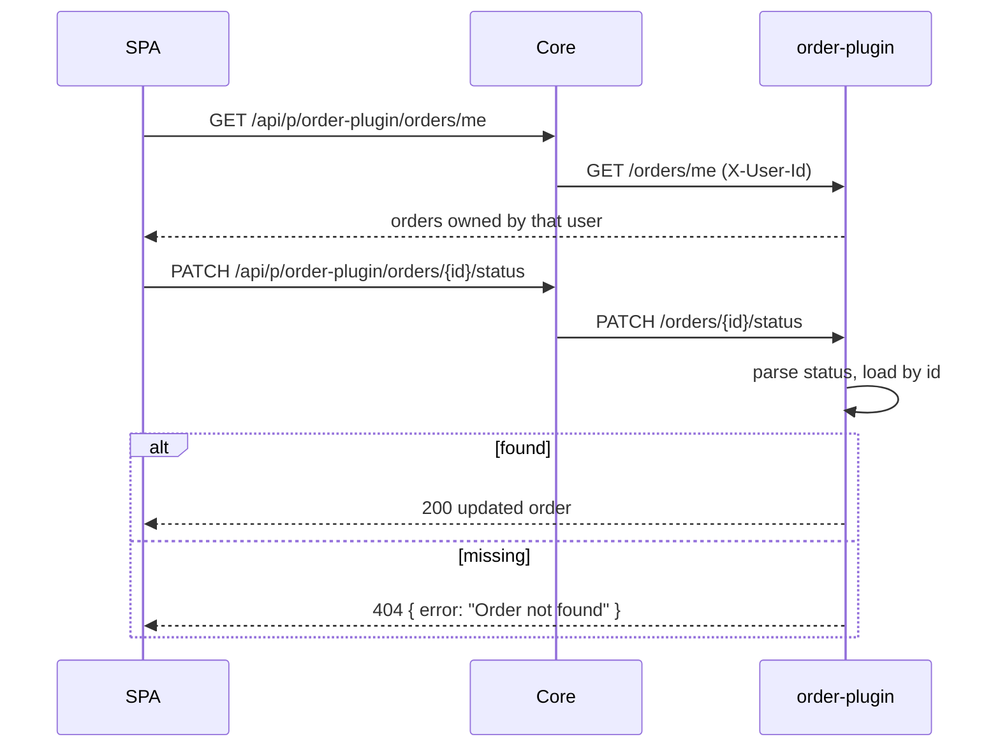
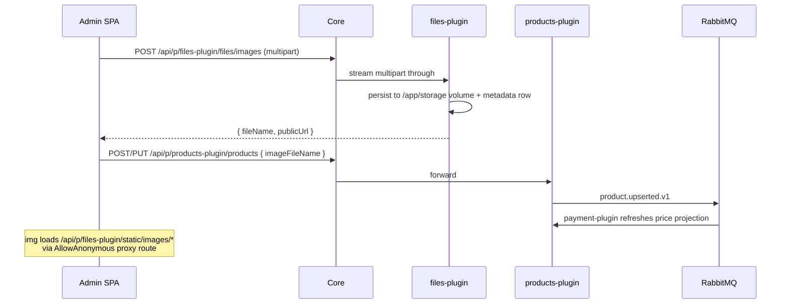

# Architecture & Flow Documentation

A plugin-based, self-hostable e-commerce platform. The **core** owns only authentication, plugin
management and request proxying. Every business capability — products, cart, payments, orders,
files — is an **independently containerized plugin** with its own database, HTTP API, and place in
an event-driven choreography.

---

## Table of contents

1. [System overview](#1-system-overview)
2. [Repository layout](#2-repository-layout)
3. [Technology stack](#3-technology-stack)
4. [The core API](#4-the-core-api)
5. [The plugin runtime](#5-the-plugin-runtime)
6. [The plugin contract](#6-the-plugin-contract)
7. [Plugin catalogue](#7-plugin-catalogue)
8. [Event-driven integration](#8-event-driven-integration)
9. [End-to-end flows](#9-end-to-end-flows)
10. [Frontend architecture](#10-frontend-architecture)
11. [Data model](#11-data-model)
12. [Configuration](#12-configuration)
13. [Development workflow](#13-development-workflow)
14. [Operational runbook](#14-operational-runbook)
15. [Security model](#15-security-model)
16. [Known limitations](#16-known-limitations)

---

## 1. System overview

The guiding constraint is that **the core knows nothing about commerce**. It cannot list a product,
price a cart or record an order. It can only authenticate a user, start a container from a manifest,
and forward an HTTP request to it. All domain behaviour is pluggable and removable.



Two communication channels exist, and the distinction matters:

| Channel | Direction | Used for | Consistency |
|---|---|---|---|
| **HTTP through the core proxy** | client → core → plugin | Queries, user-initiated commands | Synchronous |
| **RabbitMQ topic exchange** | plugin → plugin | Cross-plugin state propagation | Eventually consistent |

Plugins **never call each other over HTTP**. Any cross-plugin effect travels as an integration
event. This is what keeps plugins independently deployable.

---

## 2. Repository layout

| Path | Purpose |
|---|---|
| `backend/src/ECommerce.Api/` | Core API: auth, plugin management, proxy controllers |
| `backend/src/ECommerce.Core/` | Core entities (`User`, `PluginInstallation`) |
| `backend/src/ECommerce.Infrastructure/` | `AppDbContext` for the core database |
| `backend/src/ECommerce.PluginRuntime/` | Docker orchestration + marketplace catalog reader |
| `backend/src/ECommerce.PluginContracts/` | `PluginManifest` — the plugin ↔ host contract |
| `backend/src/ECommerce.IntegrationContracts/` | Versioned event envelope and payloads |
| `backend/plugins/*/` | Six self-contained plugin applications |
| `backend/marketplace/catalog.json` | Static marketplace catalog |
| `backend/tests/ECommerce.Api.Tests/` | xUnit tests |
| `backend/docker-compose.yml` | Infrastructure + plugin image builds |
| `webclient/` | Angular 21 SPA (PrimeNG / Sakai) |

Each plugin follows the same internal layering:

```
plugins/<name>-plugin/
├── Api/              → minimal-API endpoints + request/response contracts
├── Application/      → service interfaces, business rules, event handlers
├── Domain/Entities/  → entities owned by this plugin
├── Infrastructure/
│   ├── Messaging/    → RabbitMQ topology, publisher, consumer
│   └── Persistence/  → EF Core DbContext + repositories
├── plugin.json       → manifest
└── Program.cs        → composition root, binds 0.0.0.0:8080
```

---

## 3. Technology stack

| Layer | Technology |
|---|---|
| Backend | .NET 10, ASP.NET Core minimal APIs + MVC controllers |
| Persistence | PostgreSQL 16 via EF Core (`EnsureCreatedAsync`, no migrations) |
| Messaging | RabbitMQ 3 (topic exchange, manual ack) |
| Orchestration | Docker.DotNet against the mounted Docker socket |
| Auth | JWT bearer tokens |
| Payments | Stripe (`StripePaymentGateway`) |
| API docs | OpenAPI + Scalar (`/scalar/v1`), Swagger UI (dev only) |
| Frontend | Angular 21, standalone components, zoneless CD, PrimeNG |

---

## 4. The core API

### 4.1 Startup pipeline

`backend/src/ECommerce.Api/Program.cs` wires: `.env` loading → JWT options → `PluginRuntimeOptions`
→ `AppDbContext` → JWT bearer auth → plugin runtime services → CORS → controllers → OpenAPI. After
`Build()`, it runs `EnsureCreatedAsync()`, mounts static files, then
`UseCors → UseAuthentication → UseAuthorization → MapControllers`.

Critical operational detail: `PluginReconciliationHostedService` is an `IHostedService` whose
`StartAsync` reconciles **once, at boot**. There is no periodic loop.

### 4.2 Authentication

| Route | Auth | Purpose |
|---|---|---|
| `POST /api/auth/register` | anonymous | Create account, return JWT |
| `POST /api/auth/login` | anonymous | Authenticate, return JWT |
| `GET /api/auth/me` | JWT | Current user profile |
| `POST /api/auth/dev-login` | — | Dev shortcut, hardcoded credentials |
| `POST /api/auth/seed-user` | — | Seed a user |

Token validation sets `NameClaimType = email` and `MapInboundClaims = false`, so the user ID is read
as `ClaimTypes.NameIdentifier` falling back to `sub`. Proxy controllers forward that identity
downstream as headers.

> `dev-login` and `seed-user` are unauthenticated with hardcoded credentials — development
> affordances that must be removed before deployment.

### 4.3 Plugin management

`PluginsController` → `/api/plugins`:

| Route | Purpose |
|---|---|
| `GET /api/plugins/marketplace` | Catalog entries + `installed` flag (anonymous) |
| `GET /api/plugins` | Installed records |
| `POST /api/plugins/{pluginId}/install` | Install with explicit permission grants |
| `DELETE /api/plugins/{pluginId}` | Uninstall and remove containers |

`PluginService` enforces install rules: manifest must exist, **every** requested permission must be
granted, plugin must not already be installed. It persists a row in `Installing`, calls the runtime,
then flips to `Running` or `Failed` with `LastError`.

It also owns address resolution:

```csharp
public string BuildTarget(PluginInstallation installation, string path, string queryString)
    => $"http://{installation.ContainerName}:{installation.ContainerPort}/{path.TrimStart('/')}{queryString}";
```

Because host and port are **runtime-derived and refreshed on reconciliation**, the same install
record works whether the core runs in Docker or on the host.

### 4.4 Request proxying

Two proxy layers coexist.

**Generic catch-all** — `PluginProxyController` at `/api/p/{pluginId}/{**path}` accepts
GET/POST/PUT/DELETE/PATCH, streams bodies including multipart uploads, and forwards identity
headers. One anonymous exception exists:

```csharp
[AllowAnonymous]
[HttpGet("files-plugin/static/images/{**path}")]
```

so product images render in `` tags without an `Authorization` header.

**Typed controllers** — `ProductsPluginController`, `CartPluginController`,
`PaymentPluginController`, `OrderPluginController`, `FilesPluginController`. ASP.NET prefers the
more specific route template, so these win over the catch-all. They provide OpenAPI schemas,
validation, and — in the payment case — cross-plugin orchestration.

Every proxy path applies the same guards:



---

## 5. The plugin runtime

`DockerPluginRuntime` implements `StartAsync`, `ReconcileAsync`, `StopAsync`, `IsRunningAsync`.

### 5.1 Install sequence



If anything throws after the database started, the runtime removes it so failed installs leave no
orphans.

### 5.2 Environment injection

Plugins are configured entirely via injected environment variables — they never read the catalog and
never learn about other plugins:

```
ECOMMERCE_PLUGIN_ID=<id>
RabbitMq__Host / __Port / __Username / __Password / __VirtualHost
ConnectionStrings__Default=Host=<sidecar>;Port=5432;Database=…;Username=…;Password=…
Stripe__SecretKey            (only when configured)
STRIPE_WEBHOOK_SECRET        (only when configured)
```

The connection string points at the plugin's **own** sidecar. Cross-plugin database access is
structurally impossible.

### 5.3 Dual-mode networking

The runtime checks `File.Exists("/.dockerenv")` to detect whether the core is containerized:

| Core location | Plugin reachable at | Mechanism |
|---|---|---|
| In Docker | `ecom-plugin-<id>:8080` | Container DNS on shared network |
| On host (`dotnet watch`) | `localhost:<random>` | Random published host port |

This is why host/port are re-resolved on every reconciliation rather than trusted from the install
record.

### 5.4 Reconciliation and compatibility

`ReconcileAsync` reuses containers when safe. A container is **incompatible** — and recreated — if
the image reference differs, the `ecommerce.plugin.version` label differs, it is not attached to the
plugin network, or (host mode) it has no published port. Named volumes survive recreation, so plugin
data persists across upgrades.

---

## 6. The plugin contract

`PluginManifest` is the entire surface a plugin author must satisfy:

```jsonc
{
  "id": "order-plugin",
  "name": "Order Plugin",
  "version": "0.1.0",
  "image": "localhost:5000/ecommerce/order-plugin:0.1.0",
  "containerPort": 8080,
  "healthEndpoint": "/health",
  "hostApi": "^1.0.0",
  "permissions": [],
  "database": {
    "engine": "postgres",
    "image": "postgres:16-alpine",
    "databaseName": "orders",
    "username": "orders",
    "password": "orders",
    "port": 5432,
    "volumeMountPath": "/var/lib/postgresql/data"
  },
  "storage": { "volumeMountPath": "/app/storage" },
  "uiExtensions": {}
}
```

Runtime obligations:

- Bind `0.0.0.0:<containerPort>`.
- Serve `healthEndpoint` returning `200` once ready (by convention `503` when its database is unreachable).
- Read identity from `X-User-Id` / `X-User-Email` — never from a token, since the core terminates auth.
- Treat `ConnectionStrings__Default` and `RabbitMq__*` as the only configuration sources.
- Publish and consume only shared `ECommerce.IntegrationContracts.V1` types.

`database` and `storage` are optional; declaring them provisions a sidecar or named volume
automatically.

---

## 7. Plugin catalogue

| Plugin | Owns | HTTP surface (inside container) | Publishes | Consumes |
|---|---|---|---|---|
| **products-plugin** | Product catalog | `GET /products`, `GET /products/{id}`, `POST /products`, `PUT /products/{id}`, `DELETE /products/{id}` | `product.upserted.v1`, `product.deleted.v1` | — |
| **cart-plugin** | Carts & items | `GET/DELETE /carts/me`, `GET /carts/me/items/count`, `POST /carts/me/items`, `DELETE /carts/me/items/{productId}`, `POST /carts/me/checkout` | `cart.product-added.v1`, `cart.product-removed.v1`, `cart.checkout-requested.v1` | `cart.product-added.v1`, `cart.product-removed.v1`, `payment.succeeded.v1`, `order.created.v1` |
| **payment-plugin** | Payments, Stripe, price projection | `GET /payments/me`, `POST /webhooks/stripe`, `GET /webhooks/stripe/events` | `payment.succeeded.v1`, `payment.failed.v1` | `product.upserted.v1`, `product.deleted.v1`, `cart.checkout-requested.v1` |
| **order-plugin** | Immutable paid orders | `GET /orders`, `GET /orders/me`, `GET /orders/me/{id}`, `PATCH /orders/{id}/status` | `order.created.v1` | `payment.succeeded.v1` |
| **files-plugin** | Image storage | `POST /files/images`, `GET /files/images`, `GET /files/images/{name}`, `DELETE /files/images/{name}`, static `/static/images/*` | — | — |
| **hello-plugin** | Runtime smoke test | `GET /health`, `GET /greeting` | — | — |

The cart plugin **consumes its own** add/remove events. Its mutation endpoints publish and return
`202 Accepted` immediately; the consumer applies the change afterwards. Cart writes are therefore
eventually consistent by design, which is why the UI delays cart-count refreshes.

### Price projection

The payment plugin never queries the products plugin. It maintains a local read model
(`ProductPriceProjection`) fed by `product.upserted.v1` / `product.deleted.v1`. At checkout it prices
lines from that projection, so **the client cannot influence the amount charged** — it submits only
product IDs and quantities.

---

## 8. Event-driven integration

### 8.1 Envelope

| Field | Purpose |
|---|---|
| `EventName` | Also the AMQP routing key |
| `SchemaVersion` | `"1.0"` |
| `EventId` | Unique message identity |
| `OccurredAtUtc` | Domain timestamp |
| `CorrelationId` | Ties a whole checkout saga together |
| `CausationId` | The `EventId` that produced this one |
| `ResourceIds` | `ProductId`, `CartId`, `UserId`, `PaymentId`, `OrderId` |
| `Payload` | Integration data only — never internal entities |

`ResourceIds` is the correlation backbone. Cart deletion matches on `ResourceIds.CartId` rather than
looking anything up in another plugin.

### 8.2 Topology

Exchange `ecommerce.integration-events`, type **topic**, durable. One durable queue per consuming
plugin, `autoAck: false`.



### 8.3 Binding matrix

| Queue | Bound routing keys |
|---|---|
| `cart-plugin.cart-events` | `cart.product-added.v1`, `cart.product-removed.v1`, `payment.succeeded.v1`, `order.created.v1` |
| `payment-plugin.integration-events` | `product.upserted.v1`, `product.deleted.v1`, `cart.checkout-requested.v1` |
| `order-plugin.integration-events` | `payment.succeeded.v1` |

Bindings are declared by each consumer at startup. **A stale plugin image therefore silently loses
its bindings**, and the broker drops matching messages with no error anywhere. This is the single
most important failure mode in the system.

`payment.failed.v1` is published but currently has **no subscriber**.

### 8.4 Failure handling

Consumers ack on success and `BasicNackAsync(requeue: false)` on exception. There is no dead-letter
exchange, so **a failed message is discarded permanently**.

---

## 9. End-to-end flows

### 9.1 Registration and login



### 9.2 Plugin installation



### 9.3 Adding a product to the cart



### 9.4 Checkout → payment → order → cart cleanup

The central saga, spanning four plugins.



Design properties worth calling out:

- **Amount integrity** — the client never sends a price.
- **Idempotency** — payments dedupe on `CorrelationId`; orders dedupe on `PaymentId`.
- **Validation at the boundary** — the order plugin re-checks `sum(lineTotal) == amount` rather than
  trusting the publisher.
- **Two cleanup triggers** — the cart subscribes to *both* `payment.succeeded.v1` and
  `order.created.v1`. Whichever arrives first deletes the cart; the second is a harmless no-op
  because `DeleteMatchingCartAsync` returns early when the cart is missing or the ID differs.
- **Asynchronous cleanup** — `POST /me/pay` returns `202` long before the cart disappears.

### 9.5 Reading orders and updating status



`GET /orders/me/{id}` filters by owner, so users cannot read each other's orders. Status parsing
accepts the legacy value `"Paid"` and maps it onto `OrderStatus.Processed`; the persisted enum is
`Processed → Accepted → Dispatched → Completed`.

### 9.6 Product image upload



---

## 10. Frontend architecture

Angular 21, standalone components, **zoneless** change detection (components inject
`ChangeDetectorRef` and call `detectChanges()` after async work).

### 10.1 Routing

`webclient/src/app.routes.ts` splits the application in two:

| Prefix | Shell | Audience |
|---|---|---|
| `/store/**` | `StoreLayout` | Customer storefront |
| `/**` | `AppLayout` | Admin / dashboard |

Storefront routes: home, `products`, `products/:id`, `my-cart`, `checkout`, `my-orders`,
`my-payments`. Admin routes are guarded by `authGuard` and include `plugin-catalog` plus per-plugin
dashboards.

Note the asymmetry: **admin routes are guarded, storefront routes are not.** Storefront components
check for a token themselves and render a "please log in" panel.

### 10.2 Auth plumbing

- `webclient/src/app/auth/token-storage.ts` — the `ecommerce.token` localStorage key.
- `webclient/src/app/auth/auth-token.interceptor.ts` — attaches `Authorization: Bearer …` **only** to
  `http://localhost:8080` URLs, so tokens never leak to third-party hosts.
- `webclient/src/app/auth.guard.ts` — decodes the JWT client-side and checks `exp`. UX guard only;
  the server independently validates every request.

### 10.3 API access

`webclient/src/app/pages/service/product.service.ts` is the single gateway to the backend. It is
`@Injectable()` **without** `providedIn: 'root'` and is provided per component, so a module-level
`cartItemCount` signal shares the badge count across instances.

`refreshCartItemCount(delayMs)` exists specifically because cart writes are event-driven: it waits
before re-reading so the consumer has time to apply the change.

### 10.4 Empty-state handling

`GET /carts/me` returns `404` when a user has no cart — the normal state right after payment deletes
it. `my-cart.ts` and `checkout.ts` special-case that status and render an empty state, while still
surfacing genuine failures.

---

## 11. Data model

Databases are strictly partitioned; no cross-database joins or foreign keys.

**Core** (`ecommerce`) — `Users`; `PluginInstallations` (`PluginId`, `Version`, `Image`,
`ContainerName`, `ContainerPort`, `State`, `LastError`, `GrantedPermissionsJson`, timestamps).

**products** — products with price, quantity, `inventoryStatus`, category, image reference.

**cart** — `Carts` 1─* `CartItems` (cascade delete), one active cart per user.

**payment** — `PaymentRecord` (`CorrelationId` for idempotency, amount, status, provider reference,
failure reason) and `ProductPriceProjection`.

**orders** — `Orders` 1─* `OrderItems`. `OrderStatus` persisted as a **string** via
`ValueConverter`, with `"Paid"` accepted on read for backwards compatibility.

**files** — image metadata; bytes live on a Docker named volume at `/app/storage`.

---

## 12. Configuration

| Key | Default | Purpose |
|---|---|---|
| `DockerEndpoint` | `unix:///var/run/docker.sock` | Docker daemon |
| `Network` | `ecommerce_plugins` | Shared plugin network |
| `ContainerPrefix` | `ecom-plugin-` | Container naming |
| `HealthTimeout` | 30 s | Health-check budget |
| `BrokerHost/Port/Username/Password/VirtualHost` | `rabbitmq:5672`, `ecommerce` | Injected into plugins |
| `StripeSecretKey`, `StripeWebhookSecret` | empty | Forwarded to payment-plugin only |

Other sections: `Jwt`, `ConnectionStrings:Default`, `Cors:Origins`, `Marketplace:CatalogPath`,
`StaticFiles:*`.

Compose maps: core `8080`, registry `5000`, RabbitMQ `5672`/`15672`, core Postgres `5432`, plugin
databases `5433`–`5438`.

> The compose-defined `*-plugin-db` services are **not** the databases plugins use at runtime.
> Installed plugins get `ecom-plugin-<id>-db` sidecars created by the runtime. The compose ones
> support image builds and direct inspection.

---

## 13. Development workflow

### First run

```bash
cd backend
docker compose up -d registry
docker compose --profile plugin-images build
docker compose --profile plugin-images push
docker compose up --build
cd ../webclient && npm install && npm start
```

Then register at `http://localhost:4200`, open **Marketplace**, and install the plugins.

### After changing plugin code

Plugin images are **not** rebuilt by `docker compose up`, and the core reconciles only at startup:

```bash
cd backend
docker compose --profile plugin-images build <name>-plugin-image
docker compose --profile plugin-images push  <name>-plugin-image
docker rm -f ecom-plugin-<name>-plugin
docker compose restart api
```

Skipping any step leaves the old container running. Because containers keep their names and the
install record still points at them, everything *looks* healthy while running stale code.

---

## 14. Operational runbook

### The dominant failure mode: stale plugin images

Two separate incidents in this project traced to the same cause:

| Symptom | Actual cause |
|---|---|
| `PATCH /api/p/order-plugin/orders/{id}/status` → `404` | Deployed order-plugin predated the `MapPatch` endpoint |
| Cart never deleted after payment | Deployed cart-plugin predated the `payment.succeeded.v1` binding |

Both produced *no error logs*. A missing route 404s at the end of the middleware pipeline; a missing
binding means the broker never routes the message at all.

**Diagnostic order** (cheapest and most decisive first):

```bash
# 1. Is the image older than the source?
docker image inspect localhost:5000/ecommerce/cart-plugin:0.1.0 --format '{{.Created}}'

# 2. Are the expected bindings present?
docker exec ecommerce-rabbitmq-1 rabbitmqctl list_bindings \
  source_name destination_name routing_key

# 3. Backlog or dead consumer?
docker exec ecommerce-rabbitmq-1 rabbitmqctl list_queues \
  name messages consumers messages_unacknowledged

# 4. Handler exceptions?
docker logs -f ecom-plugin-cart-plugin 2>&1 | grep -iE 'error|fail|routing key'

# 5. Did the request even reach the plugin?
docker logs --tail 100 ecom-plugin-order-plugin
```

Interpretation:

- `consumers = 0` → consumer crashed or never started.
- Rising `messages` → nothing consuming.
- Rising `messages_unacknowledged` → handler hanging.
- Bindings missing but present in source → **stale image**, rebuild and redeploy.
- Plugin log shows "end of the middleware pipeline" → the route does not exist in the deployed build.

Bypass the SPA and auth to test a plugin directly on its network:

```bash
docker run --rm --network ecommerce_plugins curlimages/curl:8.10.1 -sS -i \
  -X PATCH http://ecom-plugin-order-plugin:8080/orders/<id>/status \
  -H 'Content-Type: application/json' --data '{"status":"Dispatched"}'
```

### Other checks

- Plugin container missing after `docker rm` → core only recreates on boot: `docker compose restart api`.
- `503 Plugin not running` → inspect `LastError` on the installation row.
- Inspect plugin data: `docker exec ecom-plugin-order-plugin-db psql -U orders -d orders -c '\dt'`.
- RabbitMQ management UI: `http://localhost:15672` (`ecommerce` / `ecommerce`).

---

## 15. Security model

**Implemented**

- JWT bearer auth on all plugin and management routes.
- Explicit permission grants at install time; incomplete grants rejected.
- Network isolation — plugin containers unpublished to the host when the core is containerized.
- Central choke-point — all plugin traffic passes through core controllers.
- Per-plugin database credentials; no plugin can read another's data.
- Server-side pricing; the client cannot influence charged amounts.
- Ownership filtering via token-derived `X-User-Id`.
- The token interceptor only attaches credentials to the known API origin.

**Gaps to close before production**

- `dev-login` / `seed-user` are anonymous with hardcoded credentials.
- `Jwt:Key` ships as a placeholder.
- Plugin database credentials are plaintext defaults (`cart`/`cart`, etc.).
- No image signature verification before pulling.
- No role-based authorization: any authenticated user can install plugins, list **all** orders via
  `GET /orders`, and change any order's status.
- Mounting the Docker socket into the core grants effective host-root capability — the strongest
  argument for treating the core as trusted and vetting plugin images.
- `EnsureCreatedAsync()` instead of EF migrations.

---

## 16. Known limitations

- **Reconciliation is boot-only.** A plugin that dies later stays `Running` in the database until restart.
- **No dead-letter queue.** Nacked messages are lost, so a transient database blip during
  `payment.succeeded.v1` handling permanently orphans that cart.
- **`payment.failed.v1` has no subscriber**, so failures are recorded but never acted on.
- **Static marketplace.** `catalog.json` is read from disk rather than a real registry.
- **`uiExtensions` is unused** — declared in the manifest, but the Angular shell hardcodes each
  plugin's admin page instead of loading remote UI modules.
- **Eventual consistency is visible to users.** Cart mutations return `202` and the UI compensates
  with fixed delays rather than server push.
- **`hostApi` semver is not enforced**; compatibility is checked only by exact image and version label.
- **Single cart per user**, with no stock reservation at checkout — overselling is possible.
