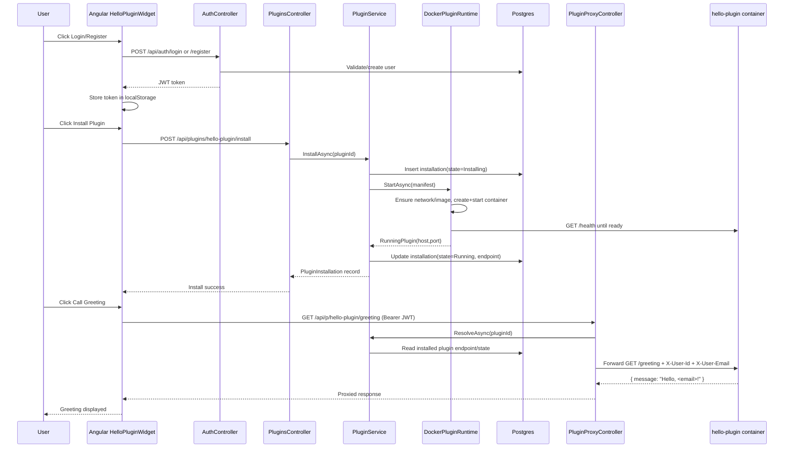

# Hello Plugin Architecture Diagram

This document explains how the hello-plugin works across frontend, backend, and Docker.

## 1) System Architecture

```mermaid
flowchart LR
    subgraph FE[Frontend]
        W[Angular HelloPluginWidget]
        LS[localStorage ecommerce.token]
    end

    subgraph API[Core Backend API :8080]
        AUTH[AuthController /api/auth/*]
        PLUG[PluginsController /api/plugins/*]
        PROXY[PluginProxyController /api/p/{pluginId}/*]
        SVC[PluginService]
        RT[DockerPluginRuntime]
    end

    subgraph DATA[Persistence]
        PG[(Postgres)]
        INST[(PluginInstallations table)]
        USERS[(Users table)]
        CAT[marketplace/catalog.json]
    end

    subgraph DOCKER[Docker]
        NET[(ecommerce_plugins network)]
        HP[ecom-plugin-hello-plugin container]
        REG[(Local Registry :5000)]
    end

    W -- login/register --> AUTH
    AUTH --> USERS
    AUTH -- JWT token --> W
    W --> LS

    W -- install/uninstall/list --> PLUG
    PLUG --> SVC
    SVC --> CAT
    SVC --> INST
    SVC --> RT
    RT --> REG
    RT --> NET
    RT --> HP

    W -- greeting call with Bearer token --> PROXY
    PROXY --> SVC
    SVC --> INST
    PROXY -- forwards HTTP + X-User-* headers --> HP
    HP -- greeting response --> PROXY
    PROXY --> W

    SVC --> PG
```

## 2) Runtime Sequence (Install + Greeting)



## 3) Key Notes

- There is one backend base API (`http://localhost:8080`), not one per plugin.
- Plugin-specific routing happens via path segments (`/api/plugins/{pluginId}` and `/api/p/{pluginId}`).
- The proxy keeps plugins private behind the core API and forwards user identity headers to the plugin.
- If the plugin container is not running or endpoint is stale, greeting calls fail during proxy forwarding.